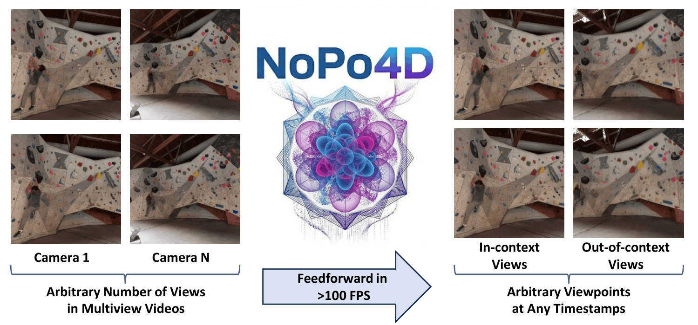

# NoPo4D: No Pose, No Problem in 4D

### Feed-Forward Dynamic 4D Gaussian Splatting from Unposed Multi-View Videos

<div align="center">

[](https://bralani.github.io/nopo4d_html/)
[](https://arxiv.org/abs/2605.22190)
[](https://huggingface.co/bralani01/nopo4d)

</div>


This work presents **NoPo4D**, the first feed-forward system that jointly addresses dynamic content, multi-view input, and unknown camera poses in a single pass. In pursuit of pose-free 4D reconstruction, NoPo4D yields two key insights:

* 💎 A **decomposed velocity representation** splits Gaussian motion into per-pixel image-plane shifts and depth changes. This allows direct supervision from 2D optical flow, obviating the need for complex 3D motion ground truth or differentiable rendering.
* ✨ A **bidirectional motion encoder** paired with **view-dependent opacity** effectively aggregates cross-view features and mitigates cross-timestep Gaussian misalignments.

🏆 NoPo4D consistently outperforms prior feed-forward baselines across four multi-view dynamic benchmarks (ExoRecon, Immersive Light Field, Kubric, and N3DV). With an optional post-optimization stage, it surpasses per-scene optimization methods while running orders of magnitude faster.

## News

- [x] Release inference code
- [x] Release pretrained checkpoint
- [ ] Release training code

## Installation

Requires Python ≥ 3.10 and a CUDA-capable GPU.

```bash
git clone --recurse-submodules https://github.com/bralani/NoPo4D.git
cd NoPo4D
pip install "torch>=2" torchvision --index-url https://download.pytorch.org/whl/cu{YOUR_CUDA_VERSION}  # we used cu121
pip install xformers
pip install -e .  # NoPo4D
```

Install the Depth Anything 3 backbone:

```bash
cd src/model/encoder/backbone/Depth-Anything-3
pip install -e .
```

Optionally, install `torch-scatter` to enable Gaussian voxelization (see [pytorch_scatter](https://github.com/rusty1s/pytorch_scatter)):

```bash
pip install torch-scatter -f https://data.pyg.org/whl/torch-2.1.0+${CUDA}.html
```

## Quick Start

### Command-line inference

Run inference on a folder of images with the provided script:

```bash
python src/inference.py \
    --image_dir assets/examples \
    --num_cameras 4 \
    --output_dir output \
    --render_timestamps 10
```

`assets/examples` contains 16 images across 4 cameras and 4 frames, named in camera-major order (`cam0_t0.png`, …, `cam3_t3.png`). The script renders from the same camera viewpoints predicted by the encoder, replaying each camera's scene at `--render_timestamps` evenly-spaced timestamps in [0, 1]. Rendered views are saved to `output/images/` and optical flow visualisations to `output/optical_flow/`.

### Python API

```python
import torch
from src.model.nopo4d import NoPo4D

# Load pretrained model from Hugging Face
model = NoPo4D.from_pretrained("bralani01/nopo4d")
model = model.to("cuda").eval()

# images:     (B, V, 3, H, W)  — camera-major order
#             V = num_cameras * num_frames
#             e.g. 2 cameras x 3 frames -> [cam0_t0, cam0_t1, cam0_t2, cam1_t0, cam1_t1, cam1_t2]
# timestamps: (B, V) in [0, 1] — same layout as images; pass None for static scenes

# Run the Encoder
encoder_output = model(
    images=images,
    timestamps=timestamps,
    num_cameras=num_cameras,
)
# encoder_output.gaussians     — 4D Gaussian primitives
# encoder_output.camera_pose   — predicted extrinsics / intrinsics
# encoder_output.depth         — per-view depth maps
# encoder_output.optical_flow  — per-view forward / backward flow

# Render novel views
render_output = model.render(
    gaussians=encoder_output.gaussians,
    extrinsics=target_extrinsics,    # (B, V, 4, 4)  c2w matrices
    intrinsics=target_intrinsics,    # (B, V, 3, 3)  normalised intrinsics
    image_shape=(H, W),
    timestamps=target_timestamps,    # (B, V) or None
)
# render_output.color: (B, V, 3, H, W)
# render_output.depth: (B, V, H, W)
```

## Citation

If you find this work useful, please cite:

```bibtex
@misc{balice2026poseproblem4dfeedforward,
      title={No Pose, No Problem in 4D: Feed-Forward Dynamic Gaussians from Unposed Multi-View Videos},
      author={Matteo Balice and Yanik Kunzi and Chenyangguang Zhang and Matteo Matteucci and Marc Pollefeys and Sungwhan Hong},
      year={2026},
      eprint={2605.22190},
      archivePrefix={arXiv},
      primaryClass={cs.CV},
      url={https://arxiv.org/abs/2605.22190},
}
```

## Acknowledgement

We thank the authors of these excellent works:
- [Depth Anything 3](https://github.com/DepthAnything/Depth-Anything-V3) — backbone ViT
- [gsplat](https://github.com/nerfstudio-project/gsplat) — CUDA Gaussian splatting backend
- [AnySplat](https://github.com/InternRobotics/AnySplat) — feed-forward Gaussian splatting framework
